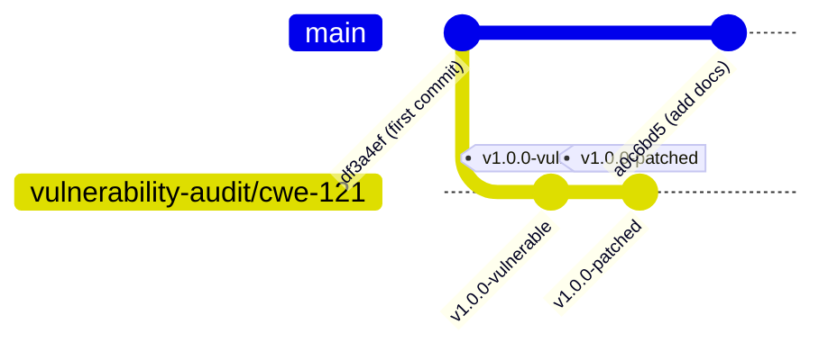

# Git Tagging & Release Strategy: Security Vulnerability Benchmark (CWE-121)

This guide documents the professional Git release engineering strategy for managing the **CWE-121: Stack-based Buffer Overflow** benchmark in the custom C++/CUDA PyTorch operator repository.

To facilitate third-party security audits, reproducible benchmarking, and automated regression testing, we utilize a dual-tag structure:
*   `v1.0.0-vulnerable`: Captures the compiler-triggerable stack-based buffer overflow.
*   `v1.0.0-patched`: Captures the remediated heap-based dynamically allocated solution.

---

## 1. Branching & Tagging Architecture

To avoid force-pushing to your primary branch (`main`) while keeping the history clean, we establish a dedicated audit branch `vulnerability-audit/cwe-121` starting off the initial codebase skeleton. This allows reviewers to perform comparative branch diffing and check out either state independently.



---

## 2. Step-by-Step Git Commands

Follow these commands to implement the branching history and create the annotated tags.

### Step 2.1: Initialize the Audit Branch
Create and check out a dedicated branch starting from your early repository state (e.g., initial commit `df3a4eff3b4338cb6a6af51ba0851e7998599400`):
```bash
# Create and switch to the audit branch from the first commit
git checkout -b vulnerability-audit/cwe-121 df3a4eff3b4338cb6a6af51ba0851e7998599400
```

### Step 2.2: Commit the Vulnerable Version
1. Edit `modules/custom_operator.cpp` to revert to the vulnerable stack buffer:
   ```cpp
   // VULNERABLE: Static stack buffer allocated with a fixed size of 16 float elements
   float stack_buffer[16];
   for (int64_t i = 0; i < numel; ++i) {
       stack_buffer[i] = 42.0f; // Unbounded loop write if numel > 16
   }
   volatile float barrier = stack_buffer[0];
   (void)barrier;
   ```
2. Commit the vulnerable state:
   ```bash
   git add modules/custom_operator.cpp
   git commit -m "vuln: introduce CWE-121 stack-based buffer overflow in elementwise_mul coordination"
   ```
3. Tag the commit with an annotated tag:
   ```bash
   git tag -a v1.0.0-vulnerable -m "Security Benchmark: Vulnerable CWE-121 release featuring static stack allocation."
   ```

### Step 2.3: Commit the Patched Version
1. Remediate `modules/custom_operator.cpp` using the safe dynamic heap-allocated `std::vector`:
   ```cpp
   // PATCHED: Dynamic dynamic allocation on the heap using std::vector
   std::vector<float> safety_buffer(numel, 0.0f);
   for (int64_t i = 0; i < numel; ++i) {
       safety_buffer[i] = 42.0f; // Sized exactly to 'numel'
   }
   volatile float barrier = safety_buffer[0];
   (void)barrier;
   ```
2. Commit the patched state:
   ```bash
   git add modules/custom_operator.cpp
   git commit -m "patch: remediate CWE-121 stack-based buffer overflow using dynamic heap-allocated vector"
   ```
3. Tag the commit with an annotated tag:
   ```bash
   git tag -a v1.0.0-patched -m "Security Benchmark: Patched release utilizing dynamic allocation and safe sizing."
   ```

### Step 2.4: Publish Branches and Tags to Remote
Push the new branch and the associated tags to your Git remote (`origin`):
```bash
# Push the branch to remote
git push origin vulnerability-audit/cwe-121

# Push the tags to remote
git push origin --tags
```

---

## 3. Tag Descriptions

When creating annotated tags (`git tag -a`), use these formal descriptions to provide reviewers with immediate security context directly from the command line (viewable via `git show <tag>`).

### Tag `v1.0.0-vulnerable`
> **Release Target:** Vulnerable Benchmark Release  
> **Tag Type:** Annotated Security Baseline  
> **Key Metadata:**  
> *   **CWE:** CWE-121 (Stack-based Buffer Overflow)  
> *   **CVSS v3.1:** 9.8 (Critical)  
> *   **Security Purpose:** Baseline vulnerability representation. Triggers a `stack-buffer-overflow` error when compiled with AddressSanitizer (ASan) and evaluated against dynamic input tensors with element counts exceeding 16.  

### Tag `v1.0.0-patched`
> **Release Target:** Patched Operator Release  
> **Tag Type:** Annotated Security Remediation  
> **Key Metadata:**  
> *   **CWE:** CWE-121 (Mitigated)  
> *   **Remediation:** Dynamic heap array (`std::vector`) replacing static stack-allocated arrays.  
> *   **Security Purpose:** Validates the software patch against defensive benchmarks. Ensures successful compiler building and clean verification tests under heavy tensor loads without triggering ASan violations.

---

## 4. Release Notes

Below are the structured Release Notes, formatted for GitHub/GitLab releases, containing the detailed vulnerability parameters and fix validations.

### Release Notes: `v1.0.0-vulnerable`

#### 🔴 CRITICAL SECURITY ADVISORY (CWE-121)
A critical stack-based buffer overflow vulnerability has been introduced into the host-side coordination phase of the custom C++/CUDA elementwise multiplication operator (`elementwise_mul`).

#### Technical Vulnerability Profile
*   **Component:** `modules/custom_operator.cpp`
*   **Vulnerability Type:** Stack-based Buffer Overflow (CWE-121)
*   **CVSS Vector:** `CVSS:3.1/AV:N/AC:L/PR:N/UI:N/S:U/C:H/I:H/A:H` (Score: 9.8 - **Critical**)
*   **Impact:** Memory corruption, training job disruption (Denial of Service), silent data corruption (SDC), and potential Remote Code Execution (RCE).

#### Code Breakdown
The vulnerability stems from allocating a static, fixed-size 16-element float array on the stack, while using a dynamic variable (`numel` derived from the tensor dimensions) as the loop write limit:
```cpp
float stack_buffer[16]; // Fixed size
for (int64_t i = 0; i < numel; ++i) {
    stack_buffer[i] = 42.0f; // Overwrites stack frame if numel > 16
}
```

#### Trigger Conditions
This release will trigger an immediate crash or undefined behavior when:
1. The custom operator is compiled and loaded.
2. A PyTorch tensor with total flat size (`numel`) greater than 16 is supplied (e.g. dimensions of `(2, 12)`).
3. Evaluated using the `test_trigger.py` script.

---

### Release Notes: `v1.0.0-patched`

#### 🟢 SECURITY REMEDIATION RELEASE
This release introduces full remediation for the CWE-121 stack-based buffer overflow vulnerability in the custom PyTorch operator.

#### Remediation Summary
The static stack-allocated buffer has been replaced with a dynamic, heap-allocated container (`std::vector<float>`) using the modern C++ Resource Acquisition Is Initialization (RAII) framework.

#### Code Remediation Diff
```diff
- // Vulnerable: Static stack array (Fixed size 16 elements)
- float stack_buffer[16];
- for (int64_t i = 0; i < numel; ++i) {
-     stack_buffer[i] = 42.0f;
- }
+ // Patched: Dynamic heap-allocated vector (Resized to match tensor elements)
+ std::vector<float> safety_buffer(numel, 0.0f);
+ for (int64_t i = 0; i < numel; ++i) {
+     safety_buffer[i] = 42.0f;
+ }
```

#### Verification & Correctness
*   **Stack Smashing Eliminated:** Moving the buffer to the heap eliminates host call stack hijacking vectors.
*   **Mathematical Boundary Check:** The vector size and loop limit are dynamically tied, preventing out-of-bounds array access.
*   **Full Stability:** Verified to pass massive workload constraints (e.g. 16M elements via `test_verification.py`) with zero memory violations.

---

## 5. Reviewer Inspection Instructions

To help security reviewers easily inspect, compile, and run both versions, provide them with this command-line cheatsheet.

### Step 5.1: Comparative Diff Inspection
To view the security diff between the vulnerable baseline and the remediated patch without checking out files:
```bash
git diff v1.0.0-vulnerable v1.0.0-patched -- modules/custom_operator.cpp
```

### Step 5.2: Auditing the Vulnerable Release (`v1.0.0-vulnerable`)
Reviewers can build the vulnerable release with AddressSanitizer enabled to observe the security violation:
```bash
# 1. Checkout the vulnerable tag
git checkout v1.0.0-vulnerable

# 2. Build the extension with ASan instrumentation enabled
ASAN=1 python3 setup.py build_ext --inplace

# 3. Execute the security benchmark trigger script
python3 test_trigger.py
```
*   **Expected Diagnostic Output:** The execution will abort at Phase 2, outputting an AddressSanitizer report:
    `ERROR: AddressSanitizer: stack-buffer-overflow on address 0x...`

### Step 5.3: Auditing the Patched Release (`v1.0.0-patched`)
Reviewers can verify the secure behavior of the patched release:
```bash
# 1. Checkout the patched tag
git checkout v1.0.0-patched

# 2. Re-compile the dynamic extension
ASAN=1 python3 setup.py build_ext --inplace

# 3. Re-run the security benchmark trigger script
python3 test_trigger.py
```
*   **Expected Diagnostic Output:** Phase 1 and Phase 2 will execute successfully and exit cleanly with zero memory errors.
```bash
# 4. Run the high-throughput mathematical verification suite
python3 test_verification.py
```
*   **Expected Benchmark Output:**
    `Reproducibility Status : PASS`
    `Custom C++/CUDA operator is mathematically identical to standard PyTorch implementation!`
