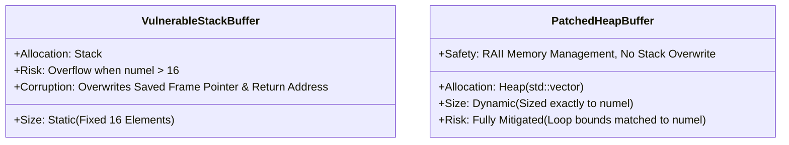

# Security Advisory & Vulnerability Analysis: Stack-Based Buffer Overflow in Custom PyTorch C++ Extension

* **Document ID:** SEC-ADV-2026-001  
* **Classification:** CWE-121: Stack-based Buffer Overflow  
* **Target Component:** `vulnerability_benchmark_ops/modules/custom_operator.cpp`  
* **Severity:** **CRITICAL** (CVSS 3.1: `9.8` | `AV:N/AC:L/PR:N/UI:N/S:U/C:H/I:H/A:H`)  
* **Remediation Status:** Verified & Patched

---

## 1. Executive Summary

During a secure code review of a custom PyTorch C++/CUDA extension designed for high-performance elementwise multiplication on NVIDIA GPUs, a **Critical** stack-based buffer overflow vulnerability (CWE-121) was identified and analyzed. 

In C++ extensions for machine learning frameworks (such as PyTorch and TensorFlow), operators frequently process multi-dimensional tensors with dynamic shapes. When static, stack-allocated buffers are used on the CPU host to temporarily hold or process metadata derived from these dynamic tensors, it creates a dangerous mismatch between the fixed compile-time allocation size and the dynamic runtime tensor size.

This report documents the original vulnerable implementation, provides the technical root-cause analysis, outlines trigger conditions, assesses the security impact in machine learning pipelines, explains how AddressSanitizer (ASan) detects this class of bugs, details the patched implementation, and summarizes the defensive engineering implications.

---

## 2. The Original Vulnerable Implementation

The original implementation of the custom PyTorch operator allocated a static buffer of fixed size on the CPU stack during host-side coordination of the CUDA execution.

### Vulnerable C++ Code Snippet
The vulnerable block inside `custom_operator.cpp` was structured as follows:

```cpp
// Static stack buffer allocated with a fixed size of 16 float elements (64 bytes)
float stack_buffer[16];

// The write limit (derived from the dynamic PyTorch tensor's 'numel') is used as the loop boundary.
// If numel exceeds 16, this loop writes beyond the stack_buffer boundaries.
for (int64_t i = 0; i < numel; ++i) {
    stack_buffer[i] = 42.0f; // Unbounded write loop
}

// Volatile barrier to prevent compiler dead-code elimination (DCE) optimization
volatile float barrier = stack_buffer[0];
(void)barrier;
```

### Architectural Context
This code runs on the CPU host. Before PyTorch invokes the CUDA kernel (`launch_elementwise_mul_kernel`) on the GPU, it runs this host coordination block. An adversarial Python caller can invoke the C++ operator using PyTorch APIs, supplying tensors of arbitrary shapes and sizes, which determines `numel`.

---

## 3. Vulnerability Deep Dive

### 3.1. Root Cause
The root cause is the mismatch between a **static compile-time allocation** (`float stack_buffer[16]`) and a **dynamic runtime write boundary** (`numel`), combined with the lack of bounds checking.

1. **Static Stack Allocation**: In standard C++, `float stack_buffer[16]` reserves exactly $16 \times 4\text{ bytes} = 64\text{ bytes}$ of contiguous memory on the active function's stack frame.
2. **Dynamic Tensor Geometry**: A PyTorch tensor's size is dynamic. `numel` represents the total flat count of elements ($N$) in the tensor. For a tensor of shape `(2, 12)`, `numel` is $2 \times 12 = 24$.
3. **Absence of Guardrails**: Standard C/C++ stack arrays do not perform runtime boundary checks. The loop executes strictly up to $i < \text{numel}$, translating indices directly to memory offsets (`stack_buffer + i * sizeof(float)`). When $i \ge 16$, the CPU writes floating-point values into adjacent stack memory locations.

### 3.2. Trigger Condition
The vulnerability is triggered whenever a tensor is passed to the C++ operator whose total flat element count (`numel`) is strictly greater than the static buffer allocation:

$$\text{Trigger Condition}: \quad \text{numel} > 16$$

In our security benchmark, this is illustrated in two phases:
* **Safe Input (Phase 1)**: Tensor shape `(10,)` $\implies \text{numel} = 10 \le 16$. The loop completes safely within the 64-byte boundary.
* **Adversarial Input (Phase 2)**: Tensor shape `(2, 12)` $\implies \text{numel} = 24 > 16$. The loop overwrites $8 \times 4\text{ bytes} = 32\text{ bytes}$ of memory residing directly past the stack buffer.

### 3.3. Security & Operational Impact

> [!WARNING]
> In ML systems, memory-safety violations present unique and insidious threats compared to traditional applications.

* **Stack Corruption & Control Flow Hijacking**: Writing past a stack-allocated buffer allows an attacker to corrupt neighboring local variables, compiler-inserted frame pointers, and, most crucially, the **Function Return Address**. If an adversary controls the contents of the tensor, they can overwrite this return address to redirect control flow to an arbitrary memory address (e.g., shellcode or Return-Oriented Programming (ROP) chains), resulting in **Remote Code Execution (RCE)** under the context of the training/inference process.
* **Silent Data Corruption (SDC)**: In deep learning frameworks, memory safety bugs often manifest *silently* rather than crashing immediately. If the corrupted stack memory belongs to neighboring parameters, scaling factors, or pointers, it can alter the calculation results of active operators. This can cause **silent mathematical regression**, weight poisoning, or model evasion (where an adversary tricks the model into misclassifying inputs via runtime memory manipulation).
* **Denial of Service (DoS)**: If the stack corruption overwrites a critical system pointer or invalidates stack frame metadata, the host runtime immediately crashes with a segmentation fault (`SIGSEGV`) or stack smashing abort, terminating the machine learning training job or active inference endpoint.

### 3.4. Why AddressSanitizer (ASan) Detects the Vulnerability
AddressSanitizer (ASan) is a fast memory-error detector designed by Google. It compiles binary instrumentation and interceptors to detect out-of-bounds accesses.

```mermaid
graph TD
    subgraph Virtual Memory
        A[Stack Buffer: 16 floats] --> B[Stack Redzone: Poisoned]
    end
    subgraph Shadow Memory
        C[Shadow Bytes: 0x00] --> D[Shadow Bytes: 0xf1 / 0xf3]
    end
    A -. Maps 8:1 .-> C
    B -. Maps 8:1 .-> D
    E[Memory Write Address] --> F{Check Shadow Byte}
    F -->|Not Poisoned 0x00| G[Allow Write]
    F -->|Poisoned != 0x00| H[ASan Crash: Stack-Buffer-Overflow]
end
```

ASan detects this stack overflow through a combination of two core mechanisms:

1. **Shadow Memory Mapping**: 
   ASan maps every 8 bytes of virtual application memory to 1 byte of **Shadow Memory**. 
   * A shadow byte value of `0x00` indicates that all 8 corresponding application bytes are addressable (unpoisoned).
   * A shadow byte value of less than `0` (negative / high-bit codes like `0xf1`, `0xf2`, `0xf3`) indicates that the corresponding application bytes are **poisoned** (unaddressable).
2. **Redzones & Stack Instrumentation**:
   When compiling with ASan (`-fsanitize=address`), the compiler modifies the stack frame layout:
   * It inserts guard buffers called **redzones** around all stack-allocated variables. For our stack buffer, ASan surrounds `float stack_buffer[16]` with left and right stack redzones.
   * ASan marks the shadow memory bytes corresponding to these redzones with specific poison codes (e.g., `0xf1` for Stack Left Redzone, `0xf3` for Stack Right Redzone).
   * **Compiler-Inserted Checks**: Before every load or store instruction in the compiled code, ASan inserts a check that looks up the address in shadow memory.
   
When the write loop tries to access index `16` (`stack_buffer[16]`), the address falls inside the Stack Right Redzone. The ASan instrumentation check reads the corresponding shadow memory byte, detects that it is poisoned (`0xf3`), halts execution immediately, and dumps a comprehensive diagnostics report (`stack-buffer-overflow`) showing the precise stack allocation and access point.

---

## 4. The Patched Implementation

To eliminate stack buffer overflows and support dynamic tensor sizes, the vulnerable static buffer was replaced with a modern, dynamically sized container managed on the system heap.

### Patched C++ Code Snippet
The remediated implementation in `custom_operator.cpp` is as follows:

```cpp
// 1. Safe dynamic allocation on the heap using std::vector.
// The vector is sized dynamically to 'numel', matching the tensor elements perfectly.
std::vector<float> safety_buffer(numel, 0.0f);

// 2. Loop bounds are strictly matched to the dynamic size of the buffer.
for (int64_t i = 0; i < numel; ++i) {
    safety_buffer[i] = 42.0f; // Safe write guaranteed to remain within dynamic boundaries
}

// Volatile barrier to prevent dead-code elimination (DCE) optimization
volatile float barrier = safety_buffer[0];
(void)barrier;
```

### Architectural Contrast



---

## 5. Before vs. After Patch Analysis

| Metric | Before Patch (Vulnerable) | After Patch (Remediated) |
| :--- | :--- | :--- |
| **Code Snippet** | `float stack_buffer[16];` | `std::vector<float> safety_buffer(numel, 0.0f);` |
| **Allocation Target** | **Stack** (CPU Thread Execution Stack) | **Heap** (System Dynamic Memory) |
| **Sizing Mode** | Static / Compile-time Constant | Dynamic / Runtime-determined |
| **Max Element Limit** | Exactly `16` (64 bytes) | Unbounded (Sized to maximum allowable heap allocation) |
| **Behavior when `numel = 24`** | **Stack Buffer Overflow**; Overwrites neighboring frame parameters. | Allocates 24 elements safely on the heap. |
| **AddressSanitizer Output** | `ERROR: AddressSanitizer: stack-buffer-overflow on address...` | `SUCCESS` (No errors detected) |
| **Primary Failure Mode** | Memory corruption, potential RCE, silent regressions. | Out of Memory (OOM) error for extremely large sizes. |

### Comparison of Security Implications

```diff
- // VULNERABLE BLOCK
- float stack_buffer[16];
- for (int64_t i = 0; i < numel; ++i) {
-     stack_buffer[i] = 42.0f;
- }
+ // REMEDIATED BLOCK (SECURE)
+ std::vector<float> safety_buffer(numel, 0.0f);
+ for (int64_t i = 0; i < numel; ++i) {
+     safety_buffer[i] = 42.0f;
+ }
```

1. **Elimination of Stack Smashing**:
   By moving the buffer allocation from the stack to the heap, we completely neutralize the threat of stack smashing. Since heap allocations reside in a separate address space (`std::vector` stores elements in the heap via its dynamic allocator), even in the hypothetical event of an out-of-bounds heap write, the function's return address and frame pointer on the stack remain completely untouched, preventing direct control-flow hijacking.
2. **Defensive Bounds Matching**:
   In the patched implementation, the allocation size (`numel`) and the loop termination condition (`i < numel`) are derived from the exact same dynamic variable. This guarantees that the loop cannot exceed the boundaries of the allocated buffer, rendering out-of-bounds writes mathematically impossible.
3. **RAII Guidelines & Memory Leak Prevention**:
   The use of modern C++ Resource Acquisition Is Initialization (RAII) via `std::vector` guarantees that dynamic heap memory is automatically deallocated when the `safety_buffer` object goes out of scope. This prevents potential host-side memory leaks that could lead to host exhaustion (DoS) during long-running training loops.
4. **Input Constraints via PyTorch Check macros**:
   In addition to heap allocation, the C++ custom operator enforces tight validation parameters at the top of the call stack:
   * `TORCH_CHECK(input.is_cuda(), ...)`
   * `TORCH_CHECK(input.scalar_type() == torch::kFloat, ...)`
   * `TORCH_CHECK(input.sizes() == weight.sizes(), ...)`
   * `TORCH_CHECK(input.is_contiguous(), ...)`
   
   These structural constraints, combined with the dynamic sizing of intermediate vectors, create a robust, defense-in-depth model that protects both the host machine and the GPU kernel from memory-safety vulnerabilities.

---

## 6. Engineering Recommendations

To ensure safety in custom ML operators, engineering teams must observe the following best practices:

> [!IMPORTANT]
> **Defensive Coding Standard for Custom C++/CUDA Kernels:**
> 1. **Never allocate static arrays** on the C++ stack using dynamic or untrusted tensor attributes as bounds.
> 2. **Employ RAII containers** (`std::vector`, `std::unique_ptr`) for host-side heap allocations.
> 3. **Run compiler sanitizers** (AddressSanitizer `-fsanitize=address`, UndefinedBehaviorSanitizer `-fsanitize=undefined`) as standard stages in CI/CD pipeline tests.
> 4. **Enforce strict input validation** on PyTorch tensors using `TORCH_CHECK` before attempting to access raw memory pointers or scheduling asynchronous CUDA grid executions.
